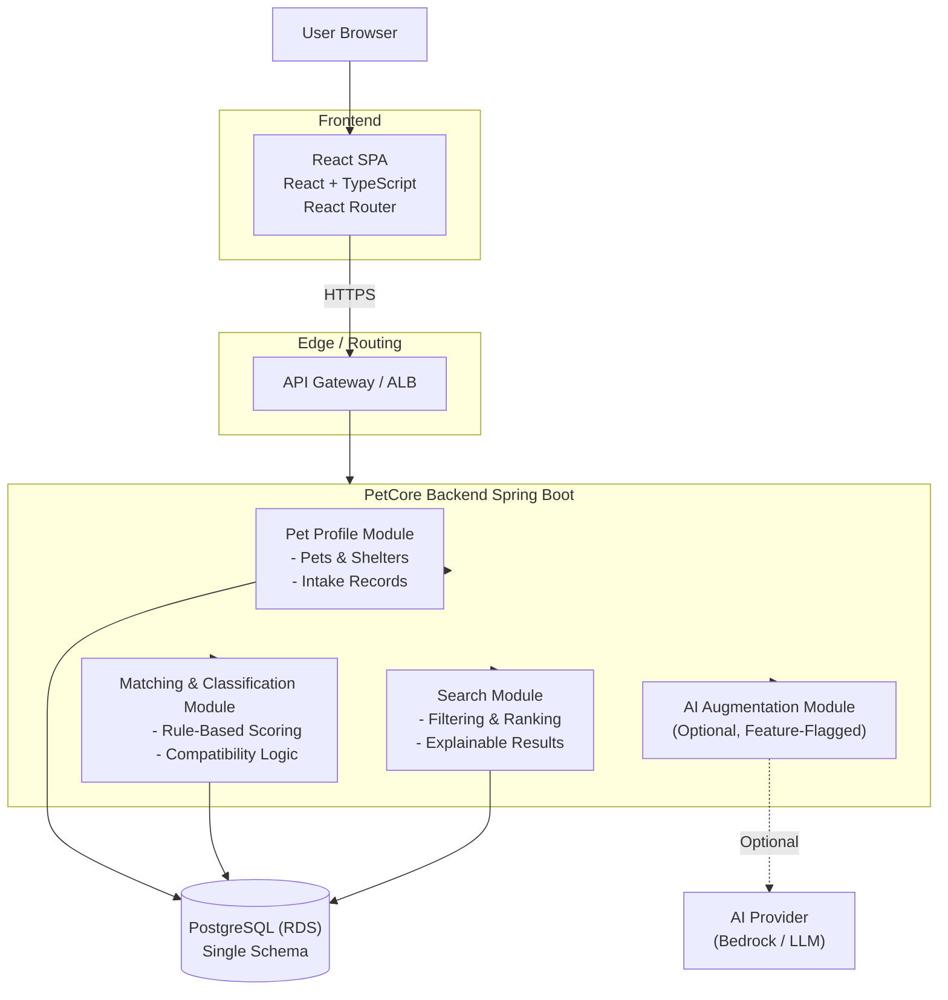

# PetCore

[](https://codecov.io/github/coding2themax/PetCore)

**PetCore** is a domain-driven monolithic application for managing pet intake, profiles, matching, and search using large public datasets from animal shelters and animal welfare organizations.

The application is intentionally designed as a **modular monolith**: core business logic is centralized, well-bounded, and fully functional **without AI**, while remaining easy to evolve into independently deployable microservices as scaling, performance, or change frequency demands increase.

PetCore emphasizes:

- **Deterministic, explainable logic** over black-box automation
- **Rule-first decision making** with optional AI augmentation
- **Clear domain boundaries** aligned with real-world scaling needs
- **Production-ready engineering practices** using Java, Spring Boot, React, and AWS

AI capabilities (such as summarization or semantic re-ranking) are **strictly optional**, feature-flagged, and never part of the critical execution path. The system continues to operate fully if AI services are disabled.

## Key Features

- Pet intake and profile management
- Rule-based breed classification and compatibility scoring
- Search and filtering with explainable ranking
- React frontend focused on transparency and user trust
- AWS-ready architecture designed for incremental service extraction

## Architectural Philosophy

PetCore starts as a cohesive monolith to reduce operational complexity and cognitive load, then **selectively extracts services** (e.g., matching, search, AI augmentation) only when justified by scaling requirements, failure isolation, or deployment cadence—mirroring how real production systems evolve.

## Architecture (Stage 1 — Modular Monolith)


```mermaid
flowchart TB
    User[User Browser]

    subgraph FE[Frontend]
        React["React SPA
        React + TypeScript
        React Router"]
    end

    subgraph Edge[Edge / Routing]
        Gateway[API Gateway / ALB]
    end

    subgraph BE["PetCore Backend Spring Boot"]


        Profile["Pet Profile Module
        - Pets & Shelters
        - Intake Records"]
        Matching["Matching & Classification Module
        - Rule-Based Scoring
        - Compatibility Logic"]
        Search["Search Module
        - Filtering & Ranking
        - Explainable Results"]
        AI["AI Augmentation Module
        (Optional, Feature-Flagged)"]
    end

    DB[("PostgreSQL (RDS)\nSingle Schema")]

    AIProvider["AI Provider\n(Bedrock / LLM)"]

    User --> React
    React -->|HTTPS| Gateway
    Gateway --> BE

    BE --> Profile
    BE --> Matching
    BE --> Search
    BE --> AI

    Profile --> DB
    Matching --> DB
    Search --> DB

    AI -. Optional .-> AIProvider
```

# PetCore Design System

## Overview

**PetCore** is an AI-augmented pet rescue and adoption platform. It consists of two main products:

1. **PetCore (Backend + Admin SPA)** — A domain-driven modular monolith built with Java/Spring Boot and a React/TypeScript frontend. Manages pet intake, profiles, rule-based matching, and AI-optional search/augmentation. GitHub: `coding2themax/PetCore`
2. **PetStore Web** — A React/TypeScript e-commerce front-end for browsing, filtering, and purchasing pets. Also serves as a showcase UI. GitHub: `coding2themax/petstore-web`

Both products share a common visual identity: purple/indigo primary palette, dark charcoal backgrounds, white cards, and a clean sans-serif type system.

### Sources

- **PetCore codebase**: https://github.com/coding2themax/PetCore (React Router v7 + Tailwind CSS v4 + Inter font)
- **PetStore Web codebase**: https://github.com/coding2themax/petstore-web (React 18 + CSS Modules + system font stack)
- No Figma files were provided.

---

## CONTENT FUNDAMENTALS

### Voice & Tone

- **Warm, trustworthy, and clear.** Copy is written for pet lovers and adopters — it's approachable without being childish.
- **Second person ("you")** throughout. "Find your perfect pet", "Your Trusted Pet Companion", "Browse our collection of loving pets looking for their forever homes."
- **Action-oriented headlines**: "Find Your Perfect Pet", "Welcome to Our Fictional Pet Store", "What's next?"
- **Short sentences and plain language**. No jargon. Descriptions focus on personality + care needs.
- **Emoji are used sparingly as inline icons** in navigation labels and feature cards (🐕, ✂️, 🧸, 💡), and in contact info rows (📍, 📞, ✉️). They function as lightweight iconography, not decoration.
- **Casing**: Title Case for nav items and headings. Sentence case for body copy and taglines.
- **Tagline style**: short, paired phrases — "Your Trusted Pet Companion."
- **Disclaimers** are honest and prominent (amber/yellow warning boxes): "This is a fictional business for demonstration purposes only."

### Copy Examples

- Hero: "Discover comprehensive pet sales and maintenance services for current and potential pet owners."
- CTA: "View All Pets", "Add to Cart", "View Details", "Schedule a Visit"
- Empty state: "🐾 No pets match your current filters. Try adjusting your search criteria or clearing filters."
- Footer encouragement: "Remember: Always adopt from local shelters and rescue organizations! 🐕🐈"

---

## VISUAL FOUNDATIONS

### Colors

**Primary**: `#667eea` (periwinkle/indigo-blue) — used for buttons, links, active nav, accents, focus rings, and hover fills.
**Primary Dark**: `#5a6fd8` — hover state of primary.
**Primary Gradient**: `linear-gradient(135deg, #667eea 0%, #764ba2 100%)` — used for header backgrounds and hero banners.
**Secondary Purple**: `#764ba2` — gradient endpoint, footer section headings.
**Danger/Price**: `#28a745` (green) — price amounts, positive health statuses.
**Alert Red**: `#ff4757` — cart count badge.
**Warning**: `#ffc107` border / `#fff3cd` bg / `#856404` text — disclaimer boxes.
**Background Light**: `#f8f9fa` — page backgrounds, feature cards, filter panels.
**Background Subtle**: `#e9ecef` — borders, dividers, tag backgrounds.
**Dark Footer**: `#343a40` — footer bg.
**Dark Charcoal**: `#333` / `#495057` — primary text.
**Muted Text**: `#6c757d` / `#adb5bd` — secondary text, descriptions.
**White**: `#ffffff` — card surfaces, inputs.

**Note (PetCore React Router logo)**: The SVG logo uses `#F44250` (red) and `#121212` (near-black) — this is the React Router boilerplate logo, NOT a custom PetCore brand mark.

### Typography

- **PetCore frontend**: `Inter` (Google Fonts, 100–900 weight range, optical sizing 14–32) via Tailwind CSS v4.
- **PetStore Web**: System font stack (`-apple-system, BlinkMacSystemFont, 'Segoe UI', Roboto...`).
- **Design system recommendation**: Use **Inter** as the canonical typeface. Fallback: `ui-sans-serif, system-ui, sans-serif`.
- **Scale**: h1 2.5rem / h2 2rem / h3 1.3–1.8rem / body 1rem / small 0.85–0.9rem.
- **Weights**: Regular (400) for body, Medium (500) for nav links, SemiBold (600) for labels/headings, Bold (700) for pet names, prices, logo text.
- **Line height**: 1.6 for body, 1.2–1.5 for headings.
- **No serif or mono display fonts** — entirely sans-serif.

### Spacing

- Base unit: `4px` (0.25rem). Cards use `1.25–2rem` internal padding. Section gaps: `2–4rem`. Grid gaps: `2rem`.
- Container max-width: `1200px`, auto-centered with `0 20px` padding.

### Backgrounds

- No full-bleed imagery. Backgrounds are solid `#f8f9fa` or the primary gradient on headers/hero banners.
- Pet images are displayed as `object-fit: cover` in fixed-height containers (200px).
- No hand-drawn illustrations, textures, or patterns.

### Borders & Radius

- Cards: `border-radius: 12–16px`.
- Buttons: `border-radius: 6–8px`.
- Tags/badges: `border-radius: 12–20px` (pill-style).
- Inputs: `border-radius: 8–12px`.
- Borders: `2px solid #e9ecef` on inputs; `1px solid #e9ecef` on dividers.
- Accent cards (ExpertGuidance): `border-left: 4px solid #667eea` — the only left-border accent pattern used.

### Shadows

- Cards: `box-shadow: 0 4px 12px rgba(0,0,0,0.1)` default; `0 8px 25px rgba(0,0,0,0.15)` on hover.
- Feature cards: `0 4px 6px rgba(0,0,0,0.1)` / hover `0 8px 15px rgba(0,0,0,0.15)`.
- Header: `0 2px 10px rgba(0,0,0,0.1)`.
- No inner shadows. No elevation tokens beyond these two tiers.

### Animation & Interaction

- **Transitions**: `all 0.3s ease` used universally for hover/focus states.
- **Hover lift**: `transform: translateY(-2px)` on cards, `translateY(-1px)` on buttons and nav links.
- **Hover image zoom**: `transform: scale(1.05)` on pet card images.
- **Focus rings**: `outline: 2px solid #667eea; outline-offset: 2px` for accessibility.
- **No page-entry animations**, no parallax, no complex keyframes.

### Iconography (see ICONOGRAPHY section)

- Primarily emoji as inline icons in the current codebase.
- No custom SVG icon library or icon font used.

### Cards

- White background, `border-radius: 16px`, `box-shadow: 0 4px 12px rgba(0,0,0,0.1)`, `overflow: hidden`.
- Hover: lift + deeper shadow.
- Pet cards include an image header zone + content body with flex-column layout.

### Layout Rules

- Sticky header (`position: sticky; top: 0; z-index: 1000`).
- Content max-width: 1200px, centered.
- Responsive breakpoints: 768px (tablet), 480px (mobile).
- Grid: `repeat(auto-fit, minmax(280–320px, 1fr))`.

### Color Vibe of Imagery

- Pet photos sourced from Unsplash (warm, natural, colorful). No grain, no desaturation, no B&W treatment.

---

## ICONOGRAPHY

### Approach

- **Emoji-as-icons**: The current codebase uses emoji extensively as inline icons for nav labels, feature cards, contact info, social links, and compatibility indicators.
  - Examples: 🐾 (general pet/brand), 🔍 (search), 🛒 (cart), 📘📷🐦📺 (social), 📍📞✉️🕒 (contact), 💉✅ (health badges), 👶⚡ (compatibility), 🐕🐱🐦🐠🐰🦎 (species)
- **No custom SVG icon system** or icon font is used in either codebase.
- **No third-party icon library** (Lucide, Heroicons, FontAwesome) is used.
- **Design system recommendation**: Adopt [Lucide Icons](https://lucide.dev) (CDN: `https://unpkg.com/lucide@latest`) for production UI components. Lucide matches the clean, stroke-weight aesthetic. Emoji can remain for informal/content contexts.

### Key Emoji Used

| Context      | Emoji |
| ------------ | ----- |
| Brand paw    | 🐾    |
| Search       | 🔍    |
| Cart         | 🛒    |
| Dogs         | 🐕    |
| Cats         | 🐱    |
| Birds        | 🐦    |
| Fish         | 🐠    |
| Rabbits      | 🐰    |
| Reptiles     | 🦎    |
| Hamsters     | 🐹    |
| Good w/ kids | 👶    |
| Energy       | ⚡    |
| Vaccinated   | 💉    |
| Spayed       | ✅    |
| Warning      | ⚠️    |

---

## Files

```
README.md                    ← This file
SKILL.md                     ← Agent skill definition
colors_and_type.css          ← CSS custom properties (colors + typography)
assets/
  logo-light.svg             ← React Router boilerplate logo (light bg) — NOT a PetCore brand mark
  logo-dark.svg              ← React Router boilerplate logo (dark bg) — NOT a PetCore brand mark
  favicon.ico                ← Site favicon
preview/
  colors-primary.html        ← Primary + brand color swatches
  colors-neutral.html        ← Neutral + semantic gray scale
  colors-semantic.html       ← Semantic colors (success, warning, danger)
  type-scale.html            ← Heading and body type scale
  type-specimens.html        ← Font weight + style specimens
  spacing-tokens.html        ← Spacing scale tokens
  shadows-radius.html        ← Shadow tiers + border radius tokens
  buttons.html               ← Button variants and states
  form-inputs.html           ← Input, select, checkbox, range
  cards.html                 ← Pet card + feature card components
  badges-tags.html           ← Badge, tag, status pill components
  nav-header.html            ← Header/nav component
  footer.html                ← Footer component
ui_kits/
  petstore-web/
    README.md                ← PetStore Web kit overview
    index.html               ← Full interactive prototype
    Header.jsx               ← Header component
    Footer.jsx               ← Footer component
    PetCard.jsx              ← Pet card component
    PetDetails.jsx           ← Pet detail modal
    PetsPage.jsx             ← Pets browse + filter page
    HomePage.jsx             ← Home page
```

## License

MIT — free to use, modify, and learn from.
