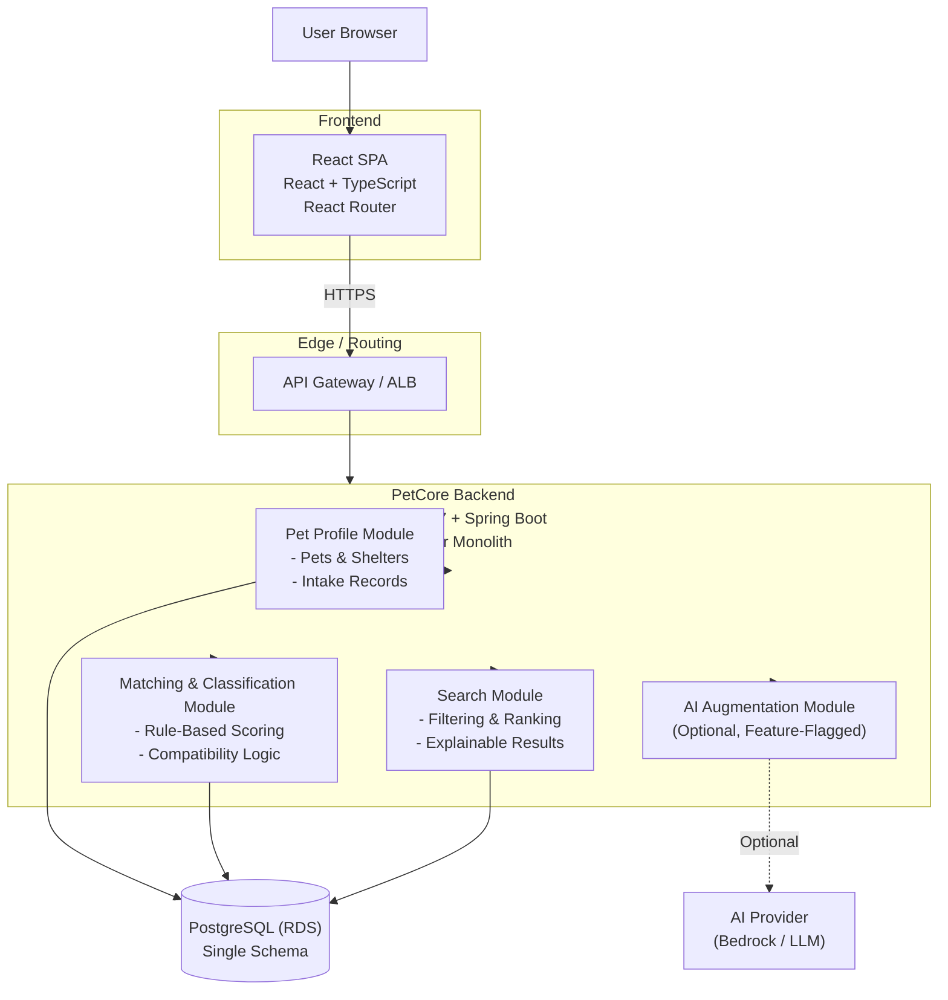

# PetCore

**PetCore** is a domain-driven monolithic application for managing pet intake, profiles, matching, and search using large public datasets from animal shelters and animal welfare organizations.

The application is intentionally designed as a **modular monolith**: core business logic is centralized, well-bounded, and fully functional **without AI**, while remaining easy to evolve into independently deployable microservices as scaling, performance, or change frequency demands increase.

PetCore emphasizes:

- **Deterministic, explainable logic** over black-box automation
- **Rule-first decision making** with optional AI augmentation
- **Clear domain boundaries** aligned with real-world scaling needs
- **Production-ready engineering practices** using Java, Spring Boot, React, and AWS

AI capabilities (such as summarization or semantic re-ranking) are **strictly optional**, feature-flagged, and never part of the critical execution path. The system continues to operate fully if AI services are disabled.

## Key Features

- Pet intake and profile management
- Rule-based breed classification and compatibility scoring
- Search and filtering with explainable ranking
- React frontend focused on transparency and user trust
- AWS-ready architecture designed for incremental service extraction

## Architectural Philosophy

PetCore starts as a cohesive monolith to reduce operational complexity and cognitive load, then **selectively extracts services** (e.g., matching, search, AI augmentation) only when justified by scaling requirements, failure isolation, or deployment cadence—mirroring how real production systems evolve.

## Architecture (Stage 1 — Modular Monolith)

## License

MIT — free to use, modify, and learn from.
