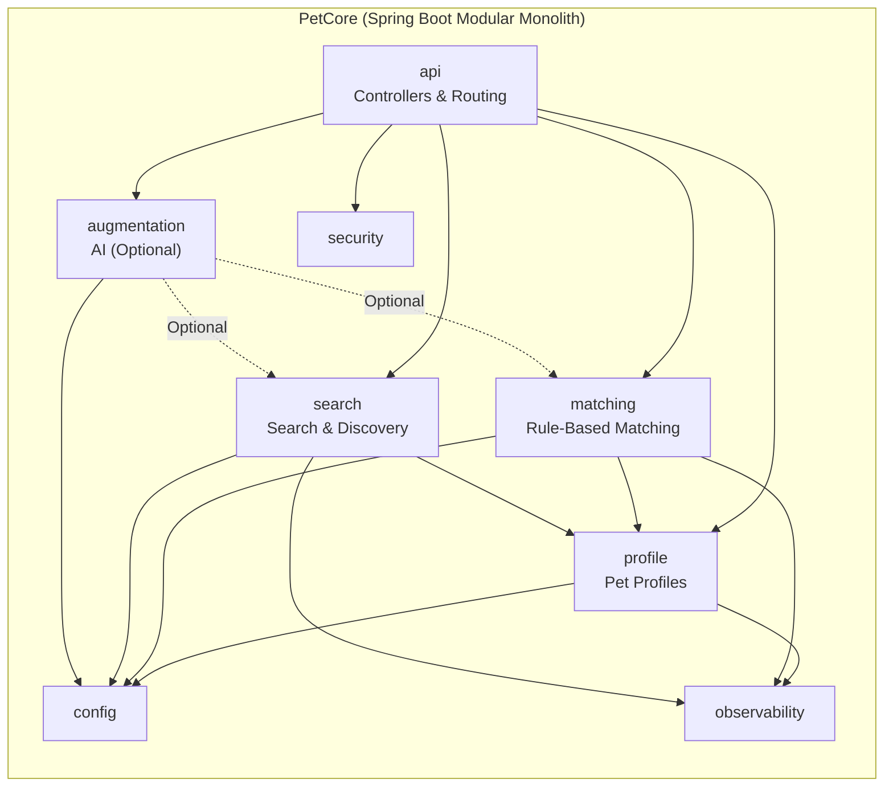
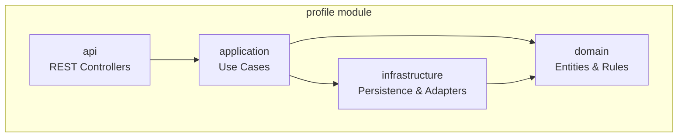
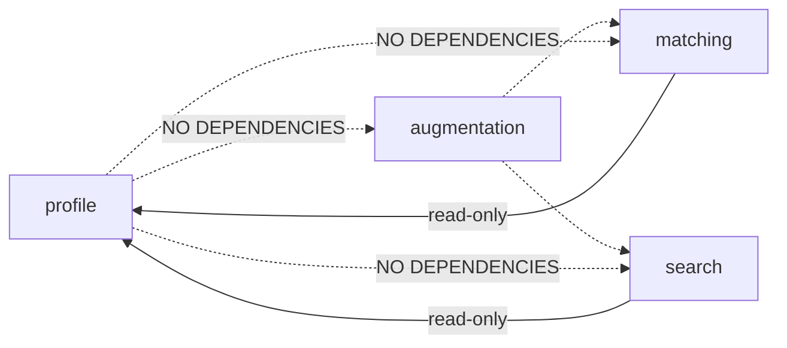
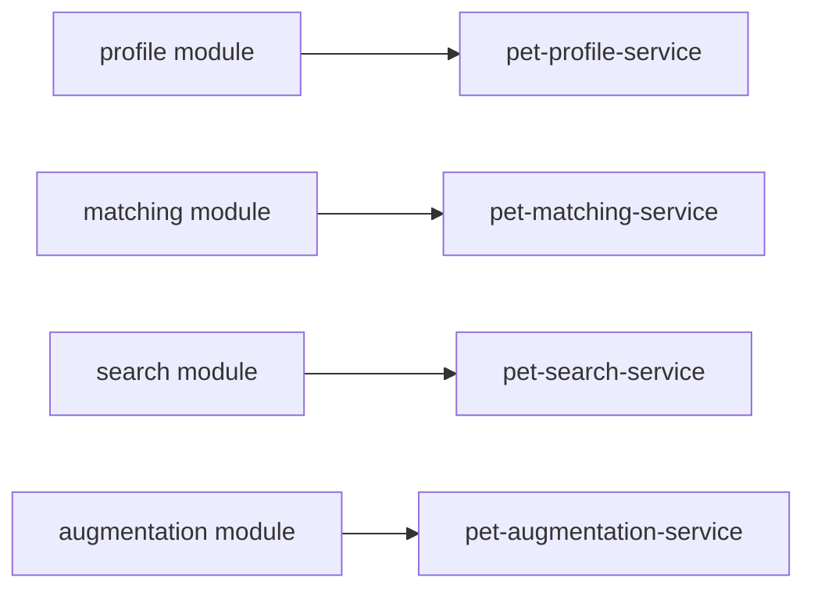

# Package Architecture

### Package-Level Overview

#### Package-Level Overview (PetCore Modular Monolith)

## Internal Structure of a Domain Module

#### Inter-Module Dependency Rules (Critical Diagram)

#### Optional: Future Service Extraction Mapping

