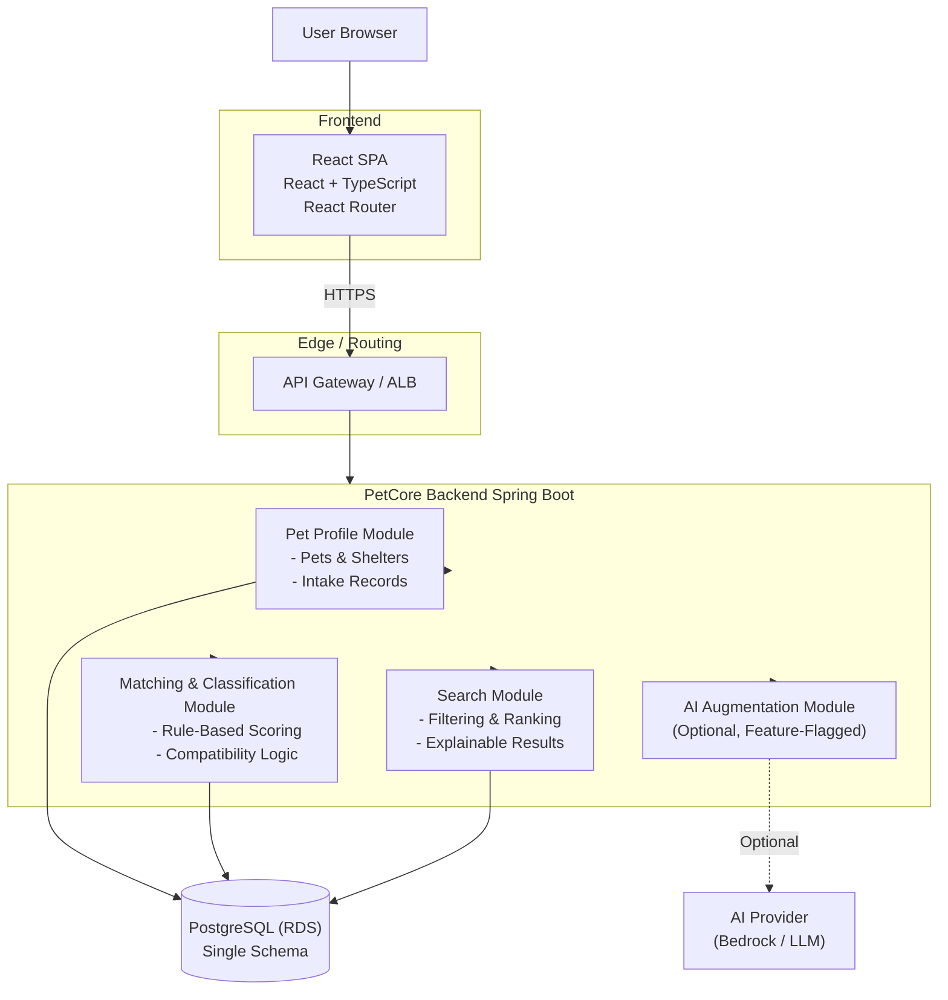
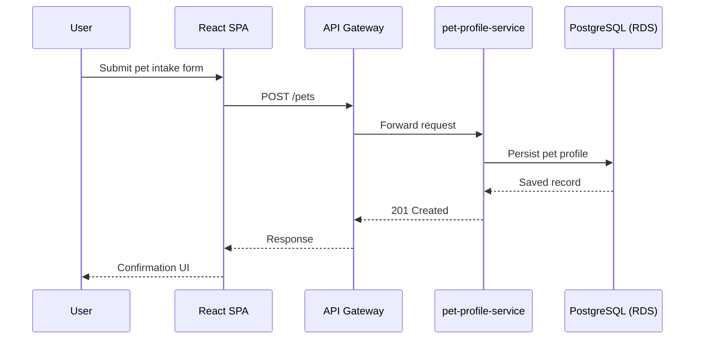
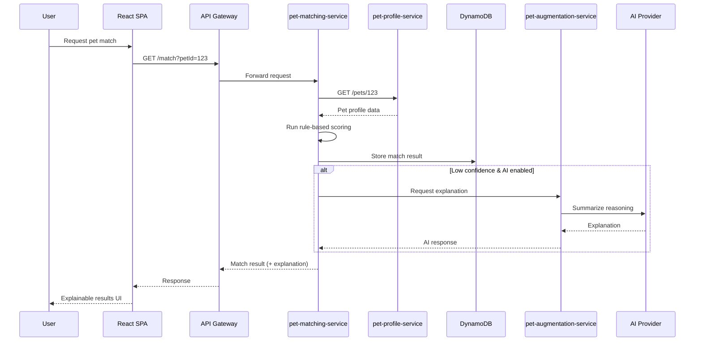
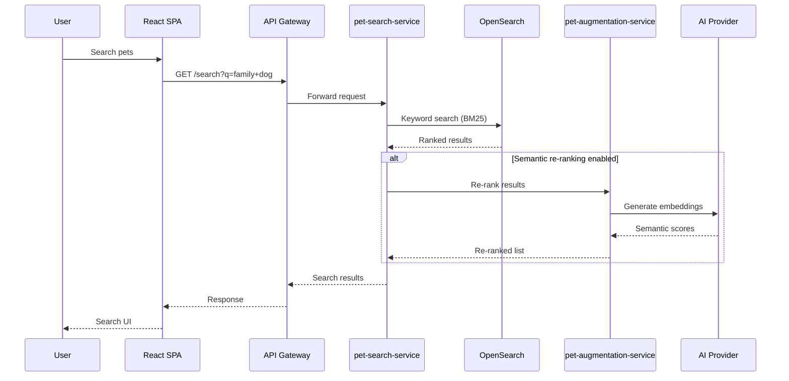

# PetCore

## Architecture (Stage 1 — Modular Monolith)



## Architecture (Stage 2 — Selective Microservices)

```mermaid

flowchart TB
    User[User Browser]

    subgraph FE[Frontend]
        React[React SPA React + TypeScript React Router]
    end

    subgraph Edge[Edge / Routing]
        Gateway[API Gateway]
    end

    React -->|HTTPS| Gateway

    subgraph Core[Core Services]
        Profile[pet-profile-service Java + Spring Boot]
    end

    subgraph Domain[Extracted Domain Services]
        Matching[pet-matching-service Java + Spring Boot]
        Search[pet-search-service Java + Spring Boot]
    end

    subgraph AIBlock[AI Services]
        AIService[pet-augmentation-service (Optional)]
    end

    ProfileDB[(PostgreSQL (RDS))]
    MatchingDB[(DynamoDB)]
    SearchDB[(OpenSearch)]

    AIProvider[AI Provider (Bedrock / LLM)]

    Gateway --> Profile
    Gateway --> Matching
    Gateway --> Search
    Gateway --> AIService

    Profile --> ProfileDB
    Matching --> MatchingDB
    Search --> SearchDB

    AIService -. Controlled .-> AIProvider

```

## Service Interaction Flows

### Pet Profile Creation



### Matching & Classification Flow (Rules First)

Purpose: Demonstrate deterministic logic + optional AI



### Search Flow with Optional Semantic Re-Ranking

Purpose: Show performance-aware AI usage


