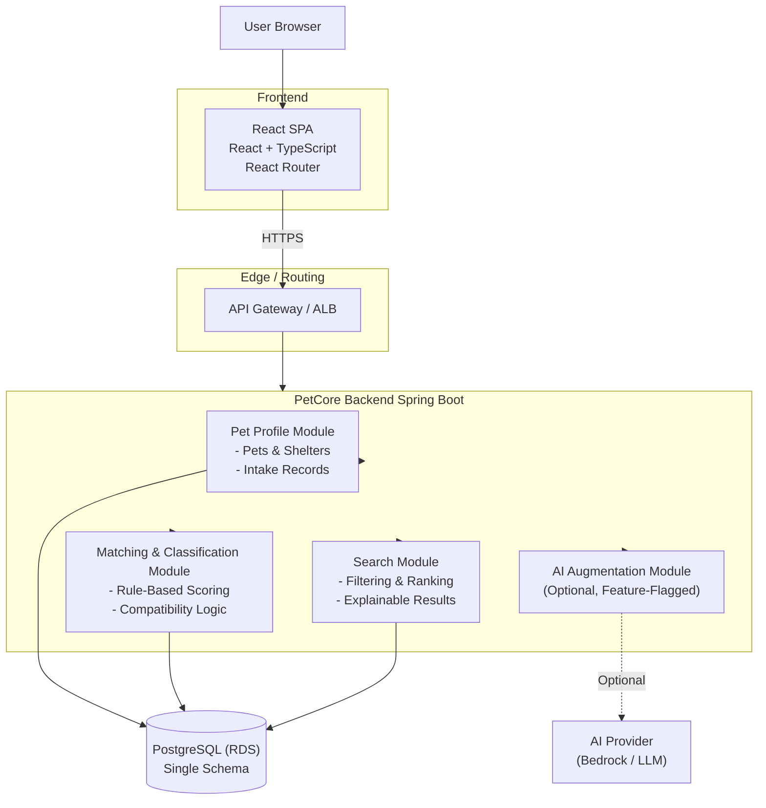
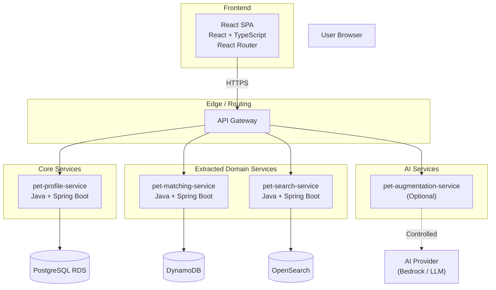
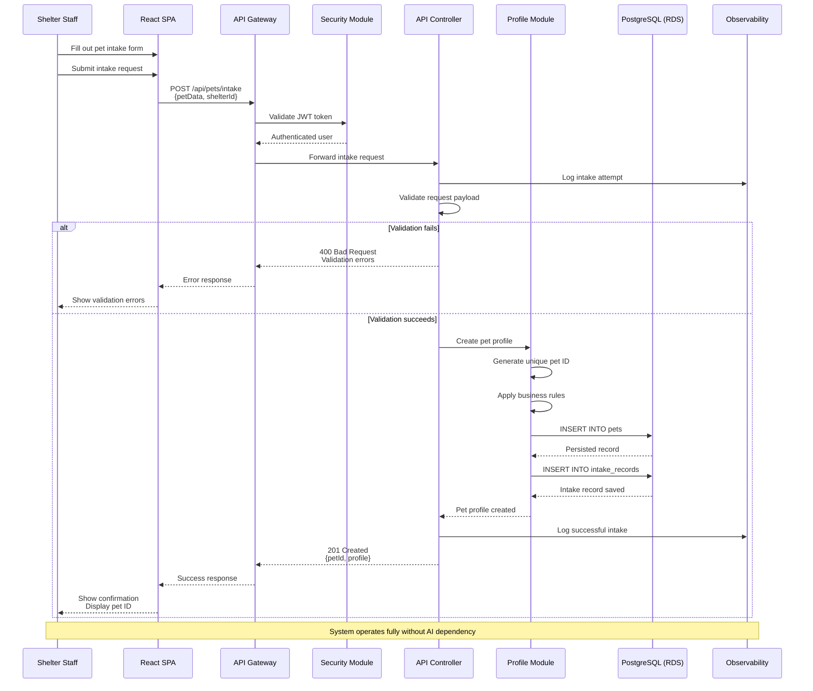

# PetCore

## Architecture (Stage 1 — Modular Monolith)

## Architecture (Stage 2 — Selective Microservices)

## Service Interaction Flows

### Pet Intake Flow

Purpose: Demonstrate end-to-end pet intake process with validation and persistence

### Pet Profile Creation

### Matching & Classification Flow (Rules First)

Purpose: Demonstrate deterministic logic + optional AI

### Search Flow with Optional Semantic Re-Ranking

Purpose: Show performance-aware AI usage

